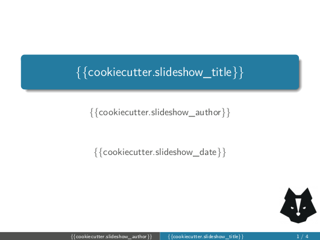

Slideshow
=========

This repository enables user to create custom slideshows completely written in
markdown which then are processed by [pandoc](https://pandoc.org/) in order to
create beautiful [beamer](https://www.overleaf.com/learn/latex/beamer)
presentations.

Repository layout is designed to serve as cookiecutter template, so user can
easily customize and start a new slideshow.

<p align="center">
  
</p>


How to install and use
----------------------

The Python library `cookiecutter` needs to be installed in your environment. In
order to achieve this, please run the following command in your command line:

```bash
pip install cookiecutter
```

Once successfully installed, start a new slideshow by simply running:

```bash
cookiecutter gh:jorgepiloto/cookiecutter-slideshow
```

Several questions will be asked to you: title for your presentation, author,
color palette...

If you are using a Linux distribution, you can easily present within your
terminal by running evince document reader in slideshow mode:

```
evince -s output_slides.pdf
```


Authors
-------

This project takes some files from other two:

1. The [pandoc-starter](https://github.com/rom1v/mdbeamer), which is released
   under MIT license by Jake Zimmerman.
2. The [mdbeamer](https://github.com/rom1v/mdbeamer) by Romain Vimont, under GPL
   license.

While both are open-source, the GPL license can include the MIT one but not the
opposite. Therefore, this project is released under GPL license. 
